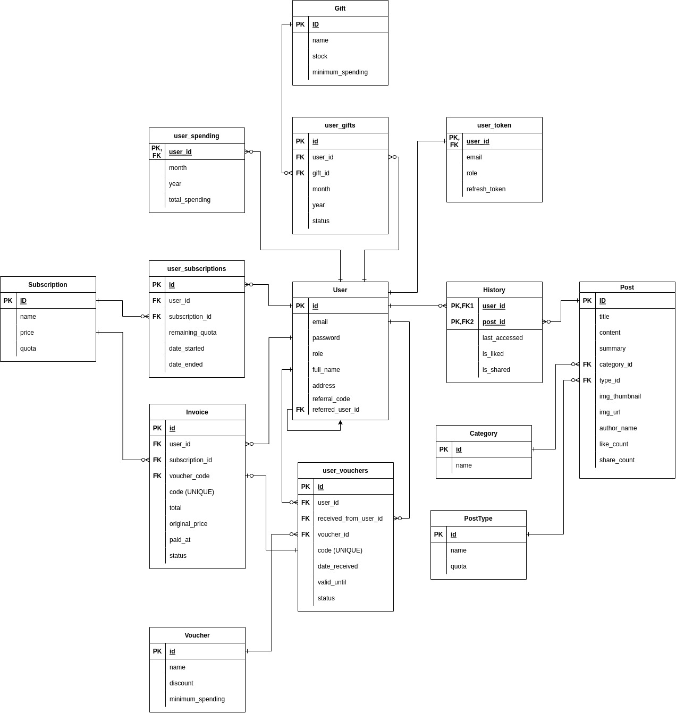

# Sea News API

Created by Tafia Alifianty Dinita Putri

## Description

This is an API documentation for Sea News API created for the purpose of fulfilling the Digitalent Batch 03 Final Project. This API is deployed to  as long as the deployment is still available. See  for the documentation

## How to Run Locally

1. Create `.env` file using the template from `.env.example` with your appropriate environment settings
2. Run `go run .` in terminal to start the API Program.
3. Open [swagger link](http://localhost:8080/docs) in your browser and try the API endpoint from there.

## ERD

